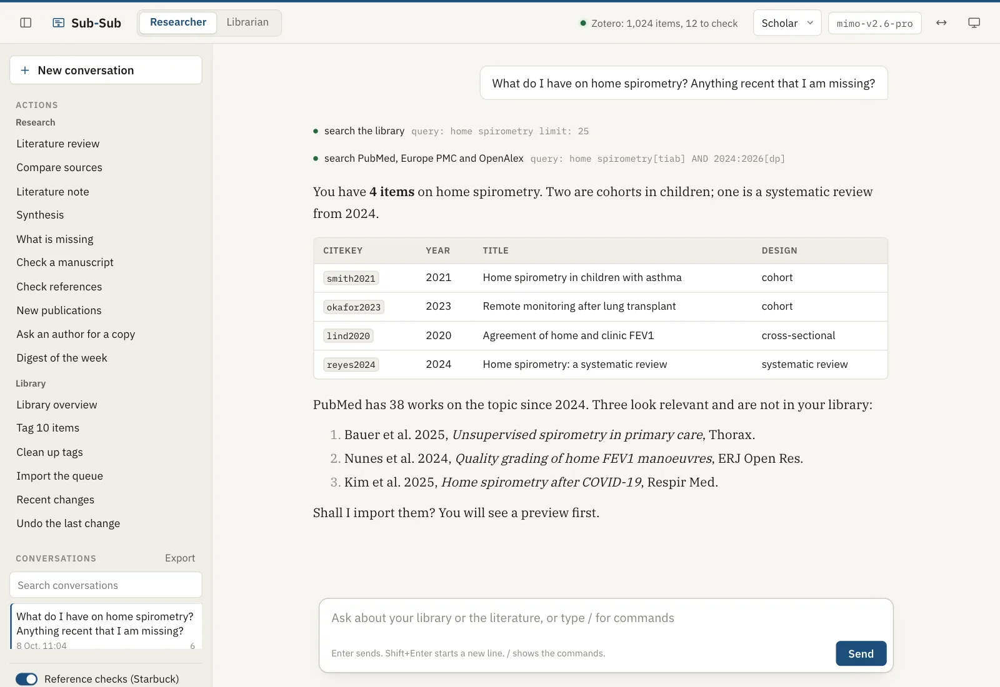
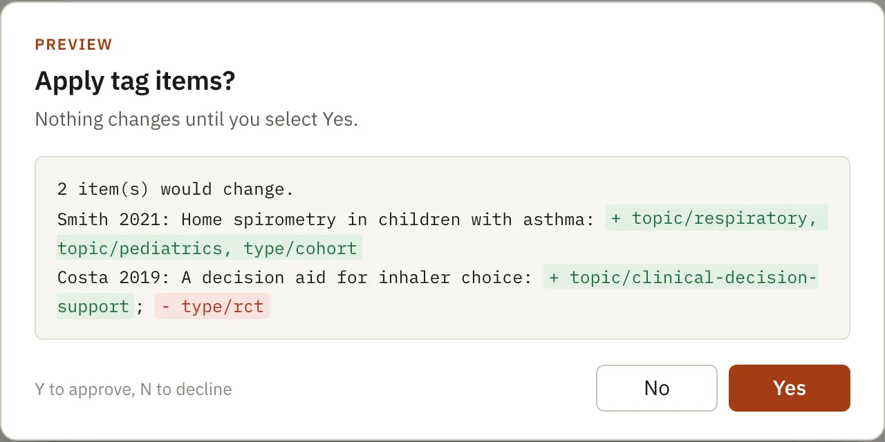

## {.title-slide-x}

::: {}
[ Sub-Sub]{.brand}

[Find, read and check the literature, from your own Zotero]{.h1}

[A one-hour workshop for clinical researchers]{.lead}

[**Tiago Jacinto**<br>Faculty of Medicine, University of Porto · MEDCIDS]{.who}
:::

::: {.shot}
{fig-alt="Sub-Sub in the browser: a question about the literature and the answer, with the tools it used."}
:::

::: notes
Welcome. A short introduction. Say now what people take home: a reading note and a rapid review made on their own library, and a rule for when to trust what the AI writes.
:::

## The hour

::: {.agenda}
::: {.now}
[0 to 15 min]{.t}

[Why, and how it works]{.h}

[The problem of invented references. What Sub-Sub does differently.]{.d}
:::

::: {}
[15 to 30 min]{.t}

[Demonstration]{.h}

[Import, read a paper, review a question, check a manuscript.]{.d}
:::

::: {.hands}
[30 to 50 min]{.t}

[Hands on]{.h}

[Three exercises on your computer, in your library.]{.d}
:::

::: {}
[50 to 60 min]{.t}

[Responsibility and questions]{.h}

[Journals, the AI-use statement, what to check.]{.d}
:::
:::

```{=html}
<div class="bring">
<div><b>A computer</b>with Zotero open and some papers with PDFs</div>
<div><b>Sub-Sub installed</b>or a colleague next to you who has it</div>
<div><b>A model key</b>the free Google key is enough for today</div>
<div><b>A question of yours</b>from a project, a protocol, a paper</div>
</div>
```

::: notes
People with Sub-Sub installed do the exercises on their own computer; the others pair with a colleague. Ask everyone to open Zotero now.
:::

## Why {.sect background-color="#1c1c1a"}

[01 · 0 to 15 min]{.sect-n}

[Language models write well. They do not always tell the truth about their sources.]{.lead}

## General chatbots invent references

::: {.cols .mid}
::: {}
A 2023 study asked ChatGPT for 84 short literature reviews on 42 topics, and checked all 636 references.

::: {.cols style="margin-top:1em"}
::: {.card}
[55%]{.num}
of the GPT-3.5 references did not exist
:::

::: {.card}
[18%]{.num}
of the GPT-4 references did not either
:::
:::
:::

::: {}
Of the references that did exist, many had errors: 43% with GPT-3.5 and 24% with GPT-4.

[An invented reference in a manuscript is a problem of integrity, not of style.]{.fragment .fade-up .lead style="display:block;margin-top:1em"}
:::
:::

[Walters WH, Wilder EI. Fabrication and errors in the bibliographic citations generated by ChatGPT. Sci Rep. 2023;13:14045. doi:[10.1038/s41598-023-41032-5](https://doi.org/10.1038/s41598-023-41032-5)]{.ref}

::: notes
Newer models make fewer errors, but the problem stays: a general chatbot writes from memory, not from sources it has read. That is what Sub-Sub changes.
:::

## What Sub-Sub does differently

::: {.cols .c3}
::: {.card .fragment .fade-up}
[It says what it read]{.h3}

Each note says if it was written from the full text, the abstract or only the metadata. Page numbers appear only with the full text.
:::

::: {.card .fragment .fade-up}
[It cites only what it found]{.h3}

Library items by citekey; other works with a DOI or PMID that a search returned. Quotes are compared with the PDF.
:::

::: {.card .fragment .fade-up}
[It asks before it changes]{.h3}

No change to Zotero happens without a preview and your Yes. Every change is recorded and can be undone.
:::
:::

[It works from **your** library, on **your** computer. Open source, MIT licence.]{.fragment .fade-up .muted style="display:block;margin-top:1.2em"}

::: notes
These three guarantees are in the program, not in the instructions to the model. The model cannot skip them.
:::

## What runs where

```{=html}
<svg class="dg" viewBox="0 0 1400 570" role="img" aria-label="Your computer has the browser, Sub-Sub, Zotero and the notes folder. Sub-Sub sends messages to the model provider and search terms to the bibliographic services.">
  <defs>
    <marker id="a1" viewBox="0 0 10 10" refX="9" refY="5" markerWidth="7" markerHeight="7" orient="auto-start-reverse"><path class="ah" d="M0 1 L9 5 L0 9 Z"/></marker>
    <marker id="a1c" viewBox="0 0 10 10" refX="9" refY="5" markerWidth="7" markerHeight="7" orient="auto-start-reverse"><path class="ah acc" d="M0 1 L9 5 L0 9 Z"/></marker>
  </defs>
  <rect class="zone home" x="10" y="40" width="780" height="470" rx="16"/>
  <text class="cap" x="36" y="80"><tspan class="sect">§ </tspan>Your computer</text>

  <rect class="box" x="40" y="110" width="220" height="100" rx="10"/>
  <text class="t" x="62" y="152">Browser</text>
  <text class="s" x="62" y="182">what you see and approve</text>

  <rect class="acc-box" x="330" y="100" width="260" height="120" rx="12"/>
  <text class="t" x="354" y="146">Sub-Sub</text>
  <text class="s" x="354" y="176">searches, reads, writes,</text>
  <text class="s" x="354" y="200">checks, asks for your Yes</text>

  <rect class="box" x="330" y="350" width="260" height="110" rx="10"/>
  <text class="t" x="354" y="394">Zotero</text>
  <text class="s" x="354" y="424">your library</text>

  <rect class="box" x="40" y="350" width="220" height="110" rx="10"/>
  <text class="t" x="62" y="394">Sub-Sub folder</text>
  <text class="s" x="62" y="424">notes in plain text</text>

  <path class="ln" d="M262 160 H326" marker-start="url(#a1)" marker-end="url(#a1)"/>
  <path class="ln acc" d="M460 224 V346" marker-start="url(#a1c)" marker-end="url(#a1c)"/>
  <text class="lbl acc" x="476" y="280">preview</text>
  <text class="lbl acc" x="476" y="302">and your Yes</text>
  <path class="ln" d="M372 224 L232 346" marker-end="url(#a1)"/>
  <text class="lbl" x="288" y="266" text-anchor="end">writes</text>

  <rect class="zone" x="860" y="40" width="530" height="200" rx="16"/>
  <text class="cap" x="886" y="80"><tspan class="sect">§ </tspan>Model provider</text>
  <text class="s" x="886" y="116">the account you choose:</text>
  <text class="s" x="886" y="142">OpenCode Go, Mistral (servers in the EU),</text>
  <text class="s" x="886" y="168">Google, or your institution's model</text>
  <path class="ln dash" d="M594 140 H856" marker-start="url(#a1)" marker-end="url(#a1)"/>
  <text class="lbl" x="612" y="128">messages and what it read</text>

  <rect class="zone" x="860" y="300" width="530" height="210" rx="16"/>
  <text class="cap" x="886" y="340"><tspan class="sect">§ </tspan>Bibliographic services</text>
  <text class="m" x="886" y="378">PubMed · Europe PMC · OpenAlex</text>
  <text class="m" x="886" y="404">Crossref · Unpaywall</text>
  <text class="s" x="886" y="446">receive search terms and</text>
  <text class="s" x="886" y="472">identifiers, not your notes</text>
  <path class="ln dash" d="M594 200 C 700 200, 740 400, 856 400" marker-end="url(#a1)"/>
  <text class="lbl" x="700" y="486">searches, DOIs</text>

  <text class="s" x="10" y="556">Nothing goes to the author of Sub-Sub. Do not use patient data.</text>
</svg>
```

::: notes
What leaves the computer: to the model provider, the messages and the passages Sub-Sub read; to the bibliographic services, search terms and identifiers. For work that must stay in the EU: Mistral or an institutional model. The Privacy page of the site has a section for a data-protection officer.
:::

## Every change goes through you

```{=html}
<svg class="dg" viewBox="0 0 1400 320" role="img" aria-label="You ask, Sub-Sub makes a dry run, shows the preview, you answer Yes or No, the change is recorded and can be undone.">
  <defs>
    <marker id="a2" viewBox="0 0 10 10" refX="9" refY="5" markerWidth="7" markerHeight="7" orient="auto"><path class="ah" d="M0 1 L9 5 L0 9 Z"/></marker>
    <marker id="a2c" viewBox="0 0 10 10" refX="9" refY="5" markerWidth="7" markerHeight="7" orient="auto"><path class="ah acc" d="M0 1 L9 5 L0 9 Z"/></marker>
  </defs>
  <rect class="box" x="10" y="20" width="240" height="170" rx="12"/>
  <text class="n" x="34" y="56">1</text>
  <text class="t" x="34" y="92">You ask</text>
  <text class="s" x="34" y="124">in plain language:</text>
  <text class="s" x="34" y="148">"tag these 10 items"</text>
  <path class="ln" d="M254 105 H290" marker-end="url(#a2)"/>

  <rect class="box" x="294" y="20" width="240" height="170" rx="12"/>
  <text class="n" x="318" y="56">2</text>
  <text class="t" x="318" y="92">Dry run</text>
  <text class="s" x="318" y="124">the server works out</text>
  <text class="s" x="318" y="148">the change, without making it</text>
  <path class="ln" d="M538 105 H574" marker-end="url(#a2)"/>

  <rect class="acc-box" x="578" y="20" width="240" height="170" rx="12"/>
  <text class="n" x="602" y="56">3</text>
  <text class="t" x="602" y="92">Preview</text>
  <text class="s" x="602" y="124">item by item, what</text>
  <text class="s" x="602" y="148">goes in and what goes out</text>
  <path class="ln acc" d="M822 105 H858" marker-end="url(#a2c)"/>

  <rect class="box" x="862" y="20" width="240" height="170" rx="12"/>
  <text class="n" x="886" y="56">4</text>
  <rect class="ok-box" x="886" y="74" width="90" height="46" rx="8"/>
  <text class="t" x="931" y="105" text-anchor="middle" style="fill:var(--green)">Yes</text>
  <rect class="rust-box" x="988" y="74" width="90" height="46" rx="8"/>
  <text class="t" x="1033" y="105" text-anchor="middle" style="fill:var(--rust)">No</text>
  <text class="s" x="886" y="160">you decide</text>
  <path class="ln" d="M1106 105 H1142" marker-end="url(#a2)"/>

  <rect class="box" x="1146" y="20" width="240" height="170" rx="12"/>
  <text class="n" x="1170" y="56">5</text>
  <text class="t" x="1170" y="92">Journal</text>
  <text class="s" x="1170" y="124">every change is</text>
  <text class="s" x="1170" y="148">recorded; /undo reverts it</text>

  <path class="ln dash" d="M1266 194 V250 H130 V196" marker-end="url(#a2)"/>
  <text class="lbl" x="698" y="280" text-anchor="middle">nothing is deleted: items go to the Zotero trash</text>
</svg>
```

::: {.cols .mid style="margin-top:0.3em"}
::: {.shot}
{fig-alt="The approval dialog: a table of items with the tags to add in green, and the Yes and No buttons."}
:::

::: {}
The check is **in the program**, not in the instructions to the model. The model cannot skip it.

[If you change something in Zotero while the dialog is open, Sub-Sub shows the new preview before it applies anything.]{.small .muted}
:::
:::

::: notes
This is what most reassures people with years of references in Zotero. Show the image: green goes in, red goes out.
:::

## What a note says about itself

::: {.cols .wide-right .mid}
::: {}
```{=html}
<div class="ladder">
  <div class="rung full"><span>full text</span><p>the full text: quotes <b>with page numbers</b>, each one compared with the PDF</p></div>
  <div class="rung abs"><span>abstract</span><p>the abstract only: <b>no</b> page numbers</p></div>
  <div class="rung meta"><span>metadata</span><p>title, authors, journal: it says it <b>did not read</b> the paper</p></div>
  <p class="ladder-note">Sub-Sub refuses a note without this field, a note with page numbers but no full text, and a quote that is not in the PDF.</p>
</div>
```
:::

::: {.note-card}
```{=html}
<div class="note-bar"><span>Literature/smith2021.md</span><span>Reader</span></div>
```

::: {.note-body}
```{=html}
<div class="fm">citekey: smith2021
type: reading-note
<b>evidence: full text</b></div>
```

[Smith 2021, Home spirometry in children with asthma]{.h3}

> "Children did home spirometry twice a day for 12 weeks, with a parent, after one training session in the clinic." [p. 3]{.page} [in the PDF]{.check .ok}

[How did the authors check technique between clinic visits?]{.q}

> "Of 1,140 home manoeuvres, 71% met the ATS/ERS acceptability criteria." [p. 5]{.page} [in the PDF]{.check .ok}

[Would that rate hold in children under six?]{.q}
:::
:::
:::

[An illustration: the paper was invented for this example.]{.ref}

::: notes
In the Reader profile, for students, a note is quotes and questions, and the student writes the summary. In the other profiles a note has a summary, key points and methods. The quote check is the same in all of them.
:::

## A review with `/lit`, step by step

```{=html}
<svg class="dg" viewBox="0 0 1400 250" role="img" aria-label="Plan, library, search of three databases, screening with a log, reading, gaps, reference check, note with an evidence table.">
  <polygon class="acc-box" points="0,20 150,20 175,75 150,130 0,130"/>
  <polygon class="box" points="178,20 328,20 353,75 328,130 178,130 203,75"/>
  <polygon class="box" points="356,20 506,20 531,75 506,130 356,130 381,75"/>
  <polygon class="box" points="534,20 684,20 709,75 684,130 534,130 559,75"/>
  <polygon class="box" points="712,20 862,20 887,75 862,130 712,130 737,75"/>
  <polygon class="box" points="890,20 1040,20 1065,75 1040,130 890,130 915,75"/>
  <polygon class="box" points="1068,20 1218,20 1243,75 1218,130 1068,130 1093,75"/>
  <polygon class="ok-box" points="1246,20 1398,20 1398,130 1246,130 1271,75"/>
  <text class="t" x="80" y="83" text-anchor="middle">Plan</text>
  <text class="t" x="268" y="83" text-anchor="middle">Library</text>
  <text class="t" x="446" y="83" text-anchor="middle">Search</text>
  <text class="t" x="624" y="83" text-anchor="middle">Screen</text>
  <text class="t" x="802" y="83" text-anchor="middle">Read</text>
  <text class="t" x="980" y="83" text-anchor="middle">Gaps</text>
  <text class="t" x="1158" y="83" text-anchor="middle">Check</text>
  <text class="t" x="1334" y="83" text-anchor="middle">Note</text>
  <text class="s" x="10" y="172">the question,</text><text class="s" x="10" y="196">the terms</text>
  <text class="s" x="200" y="172">what you</text><text class="s" x="200" y="196">already have</text>
  <text class="s" x="378" y="172">PubMed, Europe</text><text class="s" x="378" y="196">PMC, OpenAlex</text>
  <text class="s" x="556" y="172">with a</text><text class="s" x="556" y="196">screening log</text>
  <text class="s" x="734" y="172">full text</text><text class="s" x="734" y="196">or abstract</text>
  <text class="s" x="912" y="172">searches for</text><text class="s" x="912" y="196">what is missing</text>
  <text class="s" x="1090" y="172">references</text><text class="s" x="1090" y="196">(Starbuck)</text>
  <text class="s" x="1268" y="172">evidence</text><text class="s" x="1268" y="196">table</text>
</svg>
```

::: {.cols .c3}
::: {.card .flat}
[The note has]{.h3}

the answer, with source numbers, and a table with the design, population, finding and what was read
:::

::: {.card .flat}
[In the `.plans` folder]{.h3}

the plan, the search phrases and the screening log, for someone else to check and repeat
:::

::: {.card .flat}
[At the end]{.h3}

it proposes the works missing from your library and imports them with one preview
:::
:::

::: notes
It takes a few minutes. Show the screening log: it is what lets someone else check and repeat the search.
:::

## A rapid review, not a systematic review

| | `/lit` in Sub-Sub | Systematic review |
|---|---|---|
| Protocol | a written plan, not registered | registered (for example, PROSPERO) |
| Screening | one AI, with a log | two people, independently |
| Risk of bias | not formally assessed | RoB 2, ROBINS-I, QUADAS-2 |
| Search | your library and three databases | a full strategy, several databases, grey literature |
| Reporting | a note with methods | PRISMA 2020 |
| Good for | scoping a question, a background section, a first search | answering a question with the best evidence |

[Every `/lit` note says this in its own section, *What this review is*.]{.muted .small}

::: notes
This is what a reviewer or a supervisor will ask about. /lit is a good start for a systematic review: the searches and the screening log are the base, and the team then screens in duplicate and assesses the risk of bias.
:::

## Demonstration {.sect background-color="#1c1c1a"}

[02 · 15 to 30 min]{.sect-n}

[Four tasks, live, on a real library.]{.lead}

## What you will see

| You need to | Ask Sub-Sub | You get |
|---|---|---|
| Add a paper | `import 10.1183/13993003.00289-2020` | the preview; Yes; then `/undo` |
| Read one paper well | `/lit-note` and title words | a note with checked quotes |
| Know what is published | `/lit` and the question | a rapid review with an evidence table |
| Check a manuscript | `/review` and `/verify` with the file | STROBE comments and checked references |

::: {.cols style="margin-top:0.5em"}
::: {.look}
**Look for:** the preview before every change, the `evidence:` field, the screening log.
:::

::: {.look}
**If the network fails:** the images on these slides show the same.
:::
:::

::: notes
Demonstration script (15 min):

1. (3 min) Import the DOI of Hall 2021 (GLI static lung volumes). Show the preview, say Yes, show the journal, run /undo.
2. (4 min) /lit-note on a paper with a PDF. Open the note, show evidence: full text, find one quote in the PDF.
3. (5 min) /lit with a clinical question from the audience. While it runs, show the plan in Research/.plans. At the end, the evidence table and the section What this review is.
4. (3 min) /review on an observational manuscript (STROBE) and /verify on its references.
:::

## Sub-Sub in the browser

::: {.cols .wide-left .mid}
::: {.shot}
{fig-alt="The Sub-Sub browser view: commands and conversations on the left, the conversation in the middle, the mode, profile and model at the top."}
:::

::: {.side}
[On the left]{.h3}
the most used commands and your earlier conversations

[At the top]{.h3}
the mode (Researcher or Librarian), the profile and the model

[In the middle]{.h3}
the conversation, with each tool Sub-Sub used

[Type `/` in the message box to see all commands.]{.small .muted}
:::
:::

::: notes
If the live demonstration fails, use this image and the approval image to explain.
:::

## Hands on {.sect background-color="#1c1c1a"}

[03 · 30 to 50 min]{.sect-n}

[Three exercises in your own library. Work in pairs if you have not installed Sub-Sub yet.]{.lead}

## Before the first exercise

::: {.cols}
::: {}
::: {.steps}
- Open **Zotero**.
- Open **Sub-Sub** from its shortcut. It opens in your browser.
- At the top, check the **number of items** in your library.
- If you see a warning, type `subsub doctor` in a terminal and follow the line that says **FIX**.
:::
:::

::: {.card .flat}
[With the free Google key]{.h3}

Long tasks can reach the per-minute limit. Sub-Sub says so and continues by itself; if it does not, wait a minute and ask it to continue.

[Without Sub-Sub installed]{.h3}

Join a colleague. Install it later with the guide on the site.
:::
:::

::: notes
Give 2 minutes. Walk round the room. The usual problems: Zotero is closed, or "Allow other applications" is off in Zotero's advanced settings.
:::

## Exercise 1 · Know your library

::: {.ex}
[4 min]{.min} Type, in plain language:

[Give me an overview of my library.]{.say}
:::

::: {.cols style="margin-top:1.2em"}
::: {.look}
**Look for:** how many items, how many without tags, how many without a citation key.
:::

::: {.look}
**Then try:** [Find duplicates.]{.say}<br>Sub-Sub shows each group with its evidence. You merge them, in Zotero.
:::
:::

```{=html}
<div class="expect"><span class="lab">An example of what you will see</span>
<div class="stat-row">
<div><b>1024</b><span>items</span></div>
<div><b>312</b><span>without tags</span></div>
<div><b>18</b><span>without a citation key</span></div>
<div><b>12</b><span>waiting for review</span></div>
</div></div>
```

::: notes
Nothing changes in this exercise: the overview and the duplicate search only read. It builds confidence.
:::

## Exercise 2 · Read a paper with Sub-Sub

::: {.ex}
[8 min]{.min} Choose a paper in your library **with a PDF** and type:

[/lit-note words from the paper's title]{.say}
:::

::: {.steps style="margin-top:0.9em"}
- Open the note that Sub-Sub wrote in the `Literature/` folder.
- Look at the `evidence:` field. Does it say `full text`?
- Choose **one** quote and find it in the PDF, on the page given.
- Talk with the person next to you: do you agree with the key points?
:::

```{=html}
<svg class="dg" viewBox="0 0 1400 200" style="margin-top:0.6em" role="img" aria-label="A quote in the note, with its page, and the same sentence in the PDF, on that page.">
  <defs><marker id="a5" viewBox="0 0 10 10" refX="9" refY="5" markerWidth="7" markerHeight="7" orient="auto"><path class="ah acc" d="M0 1 L9 5 L0 9 Z"/></marker></defs>
  <rect class="box" x="0" y="20" width="600" height="150" rx="12"/>
  <text class="m" x="24" y="54">Literature/autor2024.md</text>
  <rect x="24" y="72" width="3" height="56" fill="var(--accent)"/>
  <text x="40" y="96" style="font-family:var(--serif);font-size:20px">"... the quoted sentence, word for word ..."</text>
  <text class="m" x="40" y="124">p. 7</text>
  <text class="lbl ok" x="24" y="156">evidence: full text</text>
  <path class="ln acc" d="M606 95 H790" marker-end="url(#a5)"/>
  <text class="lbl acc" x="698" y="80" text-anchor="middle">find it on p. 7</text>
  <rect class="box" x="800" y="10" width="290" height="180" rx="6"/>
  <text class="m" x="820" y="40">PDF · page 7</text>
  <rect x="820" y="56" width="240" height="8" rx="3" fill="var(--rule)"/>
  <rect x="820" y="74" width="210" height="8" rx="3" fill="var(--rule)"/>
  <rect x="816" y="90" width="250" height="26" rx="4" fill="var(--accent-soft)" stroke="var(--accent)"/>
  <rect x="824" y="99" width="232" height="8" rx="3" fill="var(--accent)"/>
  <rect x="820" y="128" width="230" height="8" rx="3" fill="var(--rule)"/>
  <rect x="820" y="146" width="190" height="8" rx="3" fill="var(--rule)"/>
  <rect x="820" y="164" width="220" height="8" rx="3" fill="var(--rule)"/>
  <text class="s" x="1120" y="88">Sub-Sub has compared</text>
  <text class="s" x="1120" y="114">each quote with the text.</text>
  <text class="s" x="1120" y="140">You check the page.</text>
</svg>
```

::: notes
The aim is to check, not only to read. Anyone who finds a quote on another page than the one given has a good example for the final discussion.
:::

## Exercise 3 · A question of your own

::: {.ex}
[8 min]{.min} Type a question from your work, for example:

[/lit FeNO and the risk of exacerbations in adults with asthma]{.say}
:::

::: {.cols style="margin-top:1em"}
::: {.look}
**While it runs:** open `Research/.plans/` and read the plan and the search phrases.
:::

::: {.look}
**At the end:** in the evidence table, the **Read** column; and the section **What this review is**.
:::
:::

```{=html}
<div class="expect"><span class="lab">An example: part of the evidence table</span>
<table class="mini"><thead><tr><th>#</th><th>Source</th><th>Design</th><th>Population</th><th>Read</th><th>In library</th></tr></thead>
<tbody>
<tr><td>1</td><td>Author A 2021</td><td>cohort</td><td>adults, 410</td><td><span class="hl">full text</span></td><td>yes</td></tr>
<tr><td>2</td><td>Author B 2023</td><td>RCT</td><td>adults, 96</td><td><span class="hl">abstract</span></td><td>no</td></tr>
<tr><td>3</td><td>Author C 2019</td><td>systematic review</td><td>14 studies</td><td><span class="hl">full text</span></td><td>yes</td></tr>
</tbody></table></div>
```

[If you have time: [/ai-statement literature search and reading notes]{.say}]{.small style="display:block;margin-top:1em"}

::: notes
This exercise takes longer than the others. Anyone who does not finish sees the result at home. Ask one person to show their evidence table to the group.
:::

## Responsibility {.sect background-color="#1c1c1a"}

[04 · 50 to 60 min]{.sect-n}

[Whoever signs the paper answers for what it says, the references included.]{.lead}

## Journals and the use of AI

::: {.cols .wide-left}
::: {}
The ICMJE recommendations and most journals ask:

- that authors **declare** how they used AI tools;
- that an AI is **not an author**;
- that authors **answer** for the content, the references included.

[Sub-Sub drafts the statement:]{style="display:block;margin-top:0.8em"}

[/ai-statement the literature search and reading notes]{.say}
:::

::: {.card}
[The draft has]{.h3}

- the Sub-Sub version and its DOI
- the models and their providers
- the checks the program makes
- the parts in brackets for you to complete

[You put it where the journal asks, often in the Methods or the Acknowledgements.]{.small .muted}
:::
:::

[International Committee of Medical Journal Editors. Recommendations for the Conduct, Reporting, Editing, and Publication of Scholarly Work in Medical Journals. [icmje.org/recommendations](https://www.icmje.org/recommendations/)]{.ref}

::: notes
Read an example statement aloud. Each journal says where the statement goes: often the Methods or the Acknowledgements.
:::

## Before you use a note in a manuscript

::: {.cols}
::: {.steps}
- Open the source of every claim you use.
- Check the `evidence:` field: an abstract is not enough for numbers.
- Run `/verify` on the manuscript's references.
- Write the sentences yourself: the notes are working material.
- Declare the use of AI with `/ai-statement`.
:::

::: {.card .flat}
[What Sub-Sub is not]{.h3}

- It is not a systematic review.
- It is not clinical decision support.
- It is not for patient data.
- It does not replace your judgement of the evidence.
:::
:::

::: notes
These five steps are what a supervisor or a reviewer expects. Stress the first: open the source.
:::

## To continue

::: {.cols .wide-left .mid}
::: {}
[Install]{.h3}

[subsub.tiagojacinto.eu/install](https://subsub.tiagojacinto.eu/install/), about ten minutes. On a hospital computer, give the IT service the section *For your IT service*.

[For clinical researchers]{.h3}

[subsub.tiagojacinto.eu/clinicians](https://subsub.tiagojacinto.eu/clinicians/)

[Cite Sub-Sub]{.h3}

Jacinto T. Sub-Sub: a research assistant for Zotero [software]. Porto: FMUP; 2026. doi:[10.5281/zenodo.23238602](https://doi.org/10.5281/zenodo.23238602)

[Workshops and set-up for a group]{.h3}

[tiagojacinto@med.up.pt]{.mono}
:::

::: {.qr}
{fig-alt="QR code for the page For clinical researchers."}

[For clinical researchers]{.small .muted}
:::
:::

::: notes
Questions. Leave this slide on the screen during questions.
:::

## Appendix · To send to participants a week before {visibility="uncounted"}

::: {.cols}
::: {.steps}
- Install **Zotero** and make sure you have some papers **with PDFs**.
- In Zotero, open Settings, the Advanced tab, and turn on *Allow other applications on this computer to communicate with Zotero*.
- Install Sub-Sub: [subsub.tiagojacinto.eu/install](https://subsub.tiagojacinto.eu/install/).
- Get a model key. To try it without paying, a free Google key is enough.
- Bring a question from your work.
:::

::: {.card .flat}
[A hospital computer?]{.h3}

The IT service may have to allow the install. Send them the section *For your IT service* of the install page, or bring a personal computer.

[Questions before the session]{.h3}

[tiagojacinto@med.up.pt]{.mono}
:::
:::

::: notes
A support slide, to copy into the invitation email.
:::
