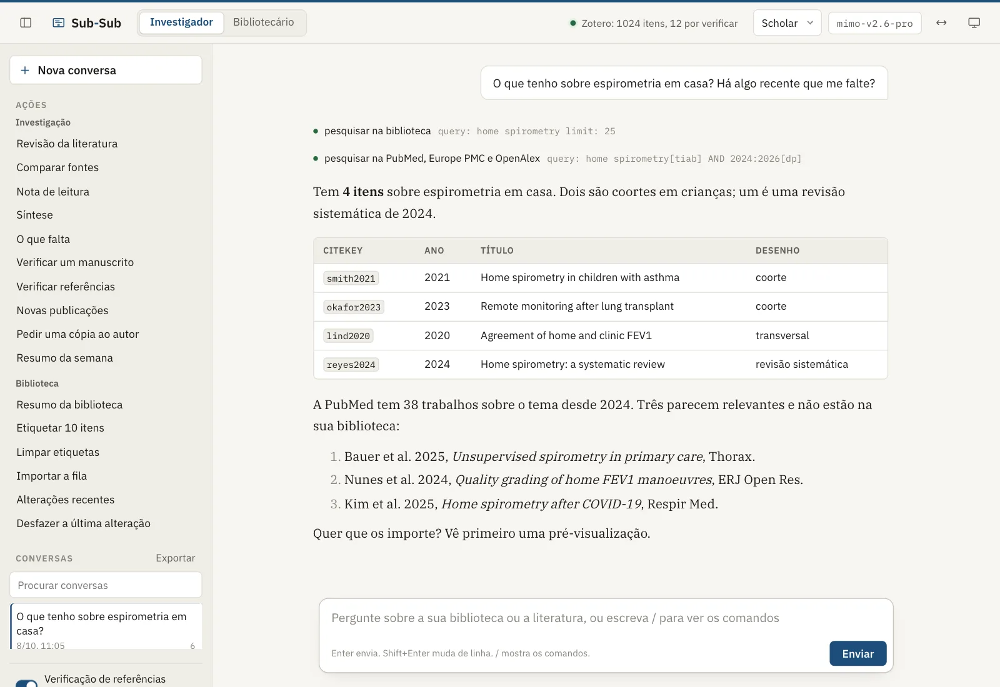
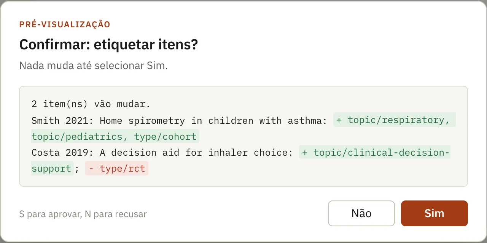

## {.title-slide-x}

::: {}
[ Sub-Sub]{.brand}

[Encontrar, ler e verificar a literatura, a partir do seu Zotero]{.h1}

[Workshop de uma hora para investigadores clínicos]{.lead}

[**Tiago Jacinto**<br>Faculdade de Medicina da Universidade do Porto · MEDCIDS]{.who}
:::

::: {.shot}
{fig-alt="A vista do Sub-Sub no navegador: uma pergunta sobre uma revisão da literatura e a resposta, com as ferramentas que usou."}
:::

::: notes
Boas-vindas. Apresentação curta. Dizer já o que vão levar: uma nota de leitura e uma revisão rápida feitas na sua própria biblioteca, e um critério para saber quando confiar no que a IA escreve.
:::

## A hora de hoje

::: {.agenda}
::: {.now}
[0 a 15 min]{.t}

[Porquê e como funciona]{.h}

[O problema das referências inventadas. O que o Sub-Sub faz de diferente.]{.d}
:::

::: {}
[15 a 30 min]{.t}

[Demonstração]{.h}

[Importar, ler um artigo, rever uma pergunta, verificar um manuscrito.]{.d}
:::

::: {.hands}
[30 a 50 min]{.t}

[Mãos à obra]{.h}

[Três exercícios no seu computador, na sua biblioteca.]{.d}
:::

::: {}
[50 a 60 min]{.t}

[Responsabilidade e perguntas]{.h}

[As revistas, a declaração de uso de IA, o que verificar.]{.d}
:::
:::

```{=html}
<div class="bring">
<div><b>Um computador</b>com o Zotero aberto e alguns artigos com PDF</div>
<div><b>O Sub-Sub instalado</b>ou um colega ao lado que o tenha</div>
<div><b>Uma chave de modelo</b>a gratuita da Google chega para hoje</div>
<div><b>Uma pergunta sua</b>de um projeto, de um protocolo, de um artigo</div>
</div>
```

::: notes
Quem tem o Sub-Sub instalado faz os exercícios no seu computador. Quem não tem acompanha em par com um colega. Pedir que abram já o Zotero.
:::

## Porquê {.sect background-color="#1c1c1a"}

[01 · 0 a 15 min]{.sect-n}

[Os modelos de linguagem escrevem bem. Nem sempre dizem a verdade sobre as fontes.]{.lead}

```{=html}
<div class="parts"><span class="on">Porquê</span><span class="">Demonstração</span><span class="">Mãos à obra</span><span class="">Responsabilidade</span></div>
```

## Os chatbots gerais inventam referências

Num estudo de 2023, pediram ao ChatGPT 84 pequenas revisões da literatura, sobre 42 temas, e verificaram as 636 referências.

```{=html}
<svg class="dg" viewBox="0 0 1400 300" role="img" aria-label="GPT-3.5: 55% das referências não existiam, 19% existiam com erros e 26% existiam sem erros. GPT-4: 18%, 20% e 62%.">
  <text class="t" x="0" y="71">GPT-3.5</text>
  <rect x="260.0" y="30" width="594.0" height="64" fill="var(--rust)"/>
  <text class="big w" x="278.0" y="73">55%</text>
  <rect x="854.0" y="30" width="209.0" height="64" fill="var(--rust-soft)"/>
  <text class="big rust-t" x="872.0" y="73">19%</text>
  <rect x="1063.0" y="30" width="277.0" height="64" fill="var(--green-soft)"/>
  <text class="big ok-t" x="1081.0" y="73">26%</text>
  <text class="t" x="0" y="165">GPT-4</text>
  <rect x="260.0" y="124" width="194.4" height="64" fill="var(--rust)"/>
  <text class="big w" x="278.0" y="167">18%</text>
  <rect x="454.4" y="124" width="212.5" height="64" fill="var(--rust-soft)"/>
  <text class="big rust-t" x="472.4" y="167">20%</text>
  <rect x="666.9" y="124" width="673.1" height="64" fill="var(--green-soft)"/>
  <text class="big ok-t" x="684.9" y="167">62%</text>
  <path class="ln" d="M260 214 H1340" style="stroke-width:1.2"/>
  <path class="ln" d="M260 208 V220" style="stroke-width:1.2"/><text class="m" x="260" y="244">0%</text>
  <path class="ln" d="M530 208 V220" style="stroke-width:1.2"/><text class="m" x="530" y="244" text-anchor="middle">25%</text>
  <path class="ln" d="M800 208 V220" style="stroke-width:1.2"/><text class="m" x="800" y="244" text-anchor="middle">50%</text>
  <path class="ln" d="M1070 208 V220" style="stroke-width:1.2"/><text class="m" x="1070" y="244" text-anchor="middle">75%</text>
  <path class="ln" d="M1340 208 V220" style="stroke-width:1.2"/><text class="m" x="1340" y="244" text-anchor="end">100%</text>
  <rect x="260" y="274" width="20" height="20" fill="var(--rust)" stroke="var(--rust)"/><text class="s" x="290" y="291">não existiam</text>
  <rect x="560" y="274" width="20" height="20" fill="var(--rust-soft)" stroke="var(--rust)"/><text class="s" x="590" y="291">existiam, com erros</text>
  <rect x="860" y="274" width="20" height="20" fill="var(--green-soft)" stroke="var(--green)"/><text class="s" x="890" y="291">existiam, sem erros</text>
</svg>
```

[As referências com erros são 43% (GPT-3.5) e 24% (GPT-4) das que existiam.]{.small .muted}

[Uma referência inventada num manuscrito é um problema de integridade, não de estilo.]{.fragment .fade-up .lead style="display:block;margin-top:0.8em"}

[Walters WH, Wilder EI. Fabrication and errors in the bibliographic citations generated by ChatGPT. Sci Rep. 2023;13:14045. doi:[10.1038/s41598-023-41032-5](https://doi.org/10.1038/s41598-023-41032-5)]{.ref}

::: notes
Os modelos mais recentes erram menos, mas o problema mantém-se: um chatbot geral escreve a partir da memória, não a partir de fontes que leu. É isto que o Sub-Sub muda.
:::

## O que o Sub-Sub faz de diferente

::: {.cols .c3}
::: {.card .fragment .fade-up}
[Diz o que leu]{.h3}

Cada nota indica se foi escrita a partir do texto completo, do resumo ou só dos metadados. Os números de página só aparecem com o texto completo.
:::

::: {.card .fragment .fade-up}
[Só cita o que encontrou]{.h3}

Itens da sua biblioteca pela citekey; outras obras com DOI ou PMID que uma pesquisa devolveu. As citações são comparadas com o PDF.
:::

::: {.card .fragment .fade-up}
[Pergunta antes de mudar]{.h3}

Nenhuma alteração ao Zotero acontece sem uma pré-visualização e o seu Sim. Tudo fica registado e pode ser anulado.
:::
:::

[Trabalha a partir da **sua** biblioteca, no **seu** computador. Código aberto, licença MIT.]{.fragment .fade-up .muted style="display:block;margin-top:1.2em"}

::: notes
Estas três garantias estão no programa, não nas instruções dadas ao modelo. O modelo não as pode saltar.
:::

## Onde corre cada coisa

```{=html}
<svg class="dg" viewBox="0 0 1400 570" role="img" aria-label="O seu computador tem o navegador, o Sub-Sub, o Zotero e a pasta das notas. O Sub-Sub envia as mensagens ao fornecedor do modelo e termos de pesquisa aos serviços bibliográficos.">
  <defs>
    <marker id="a1" viewBox="0 0 10 10" refX="9" refY="5" markerWidth="7" markerHeight="7" orient="auto-start-reverse"><path class="ah" d="M0 1 L9 5 L0 9 Z"/></marker>
    <marker id="a1c" viewBox="0 0 10 10" refX="9" refY="5" markerWidth="7" markerHeight="7" orient="auto-start-reverse"><path class="ah acc" d="M0 1 L9 5 L0 9 Z"/></marker>
  </defs>
  <rect class="zone home" x="10" y="40" width="780" height="470" rx="16"/>
  <text class="cap" x="36" y="80"><tspan class="sect">§ </tspan>O seu computador</text>

  <rect class="box" x="40" y="110" width="220" height="100" rx="10"/>
  <text class="t" x="62" y="152">Navegador</text>
  <text class="s" x="62" y="182">o que vê e aprova</text>

  <rect class="acc-box" x="330" y="100" width="260" height="120" rx="12"/>
  <text class="t" x="354" y="146">Sub-Sub</text>
  <text class="s" x="354" y="176">pesquisa, lê, escreve,</text>
  <text class="s" x="354" y="200">verifica, pede o seu Sim</text>

  <rect class="box" x="330" y="350" width="260" height="110" rx="10"/>
  <text class="t" x="354" y="394">Zotero</text>
  <text class="s" x="354" y="424">a sua biblioteca</text>

  <rect class="box" x="40" y="350" width="220" height="110" rx="10"/>
  <text class="t" x="62" y="394">Pasta do Sub-Sub</text>
  <text class="s" x="62" y="424">notas em texto simples</text>

  <path class="ln" d="M262 160 H326" marker-start="url(#a1)" marker-end="url(#a1)"/>
  <path class="ln acc" d="M460 224 V346" marker-start="url(#a1c)" marker-end="url(#a1c)"/>
  <text class="lbl acc" x="476" y="280">pré-visualização</text>
  <text class="lbl acc" x="476" y="302">e o seu Sim</text>
  <path class="ln" d="M372 224 L232 346" marker-end="url(#a1)"/>
  <text class="lbl" x="288" y="266" text-anchor="end">escreve</text>

  <rect class="zone" x="860" y="40" width="530" height="200" rx="16"/>
  <text class="cap" x="886" y="80"><tspan class="sect">§ </tspan>Fornecedor do modelo</text>
  <text class="s" x="886" y="116">a conta que escolhe:</text>
  <text class="s" x="886" y="142">OpenCode Go, Mistral (servidores na UE),</text>
  <text class="s" x="886" y="168">Google, ou um modelo da instituição</text>
  <path class="ln dash" d="M594 140 H856" marker-start="url(#a1)" marker-end="url(#a1)"/>
  <text class="lbl" x="606" y="106">mensagens e</text>
  <text class="lbl" x="606" y="128">o que leu</text>

  <rect class="zone" x="860" y="300" width="530" height="210" rx="16"/>
  <text class="cap" x="886" y="340"><tspan class="sect">§ </tspan>Serviços bibliográficos</text>
  <text class="m" x="886" y="378">PubMed · Europe PMC · OpenAlex</text>
  <text class="m" x="886" y="404">Crossref · Unpaywall</text>
  <text class="s" x="886" y="446">recebem termos de pesquisa e</text>
  <text class="s" x="886" y="472">identificadores, não as suas notas</text>
  <path class="ln dash" d="M594 200 C 700 200, 740 400, 856 400" marker-end="url(#a1)"/>
  <text class="lbl" x="606" y="190">pesquisas, DOI</text>

  <text class="s" x="10" y="556">Nada vai para o autor do Sub-Sub. Não use dados de doentes.</text>
</svg>
```

::: notes
O que sai do computador: para o fornecedor do modelo, as mensagens e as passagens que o Sub-Sub leu; para os serviços bibliográficos, termos de pesquisa e identificadores. Para trabalho que tem de ficar na UE: Mistral ou um modelo da instituição. A página Privacidade do site tem uma secção para o encarregado de proteção de dados.
:::

## Cada alteração passa por si

```{=html}
<svg class="dg" viewBox="0 0 1400 280" role="img" aria-label="Pede, o Sub-Sub prepara um ensaio, mostra a pré-visualização, responde Sim ou Não, a alteração fica registada e pode ser anulada.">
  <defs>
    <marker id="a2" viewBox="0 0 10 10" refX="9" refY="5" markerWidth="7" markerHeight="7" orient="auto"><path class="ah" d="M0 1 L9 5 L0 9 Z"/></marker>
    <marker id="a2c" viewBox="0 0 10 10" refX="9" refY="5" markerWidth="7" markerHeight="7" orient="auto"><path class="ah acc" d="M0 1 L9 5 L0 9 Z"/></marker>
  </defs>
  <rect class="box" x="10" y="20" width="240" height="170" rx="12"/>
  <text class="n" x="34" y="56">1</text>
  <text class="t" x="34" y="92">Pede</text>
  <text class="s" x="34" y="124">em linguagem corrente:</text>
  <text class="s" x="34" y="148">"etiqueta estes 10 itens"</text>
  <path class="ln" d="M254 105 H290" marker-end="url(#a2)"/>

  <rect class="box" x="294" y="20" width="240" height="170" rx="12"/>
  <text class="n" x="318" y="56">2</text>
  <text class="t" x="318" y="92">Ensaio</text>
  <text class="s" x="318" y="124">o servidor calcula a</text>
  <text class="s" x="318" y="148">alteração sem a fazer</text>
  <path class="ln" d="M538 105 H574" marker-end="url(#a2)"/>

  <rect class="acc-box" x="578" y="20" width="240" height="170" rx="12"/>
  <text class="n" x="602" y="56">3</text>
  <text class="t" x="602" y="92">Pré-visualização</text>
  <text class="s" x="602" y="124">item a item, o que</text>
  <text class="s" x="602" y="148">entra e o que sai</text>
  <path class="ln acc" d="M822 105 H858" marker-end="url(#a2c)"/>

  <rect class="box" x="862" y="20" width="240" height="170" rx="12"/>
  <text class="n" x="886" y="56">4</text>
  <rect class="ok-box" x="886" y="74" width="90" height="46" rx="8"/>
  <text class="t" x="931" y="105" text-anchor="middle" style="fill:var(--green)">Sim</text>
  <rect class="rust-box" x="988" y="74" width="90" height="46" rx="8"/>
  <text class="t" x="1033" y="105" text-anchor="middle" style="fill:var(--rust)">Não</text>
  <text class="s" x="886" y="160">decide você</text>
  <path class="ln" d="M1106 105 H1142" marker-end="url(#a2)"/>

  <rect class="box" x="1146" y="20" width="240" height="170" rx="12"/>
  <text class="n" x="1170" y="56">5</text>
  <text class="t" x="1170" y="92">Registo</text>
  <text class="s" x="1170" y="124">cada alteração fica</text>
  <text class="s" x="1170" y="148">registada; /undo anula</text>

  <path class="ln dash" d="M1266 194 V236"/>
  <text class="lbl" x="1386" y="266" text-anchor="end">nada é apagado: os itens vão para o lixo do Zotero</text>
</svg>
```

::: {.cols .mid style="margin-top:0.3em"}
::: {.shot .bare}
{fig-alt="A janela de aprovação: uma tabela de itens com as etiquetas a acrescentar a verde, e os botões Sim e Não."}
:::

::: {}
A verificação está **no programa**, não nas instruções ao modelo. O modelo não a pode saltar.

[Se mudar algo no Zotero enquanto a janela está aberta, o Sub-Sub mostra a nova pré-visualização antes de aplicar.]{.small .muted}
:::
:::

::: notes
Este é o ponto que mais tranquiliza quem tem anos de referências no Zotero. Mostrar a imagem: verde o que entra, vermelho o que sai.
:::

## O que uma nota diz sobre si própria

::: {.cols .wide-right .mid}
::: {}
```{=html}
<div class="ladder">
  <div class="rung full"><span>full text</span><p>texto completo: citações <b>com página</b>, cada uma comparada com o PDF</p></div>
  <div class="rung abs"><span>abstract</span><p>só o resumo: <b>sem</b> números de página</p></div>
  <div class="rung meta"><span>metadata</span><p>título, autores, revista: diz que <b>não leu</b> o artigo</p></div>
  <p class="ladder-note">O Sub-Sub recusa uma nota sem este campo, uma nota com páginas sem o texto completo, e uma citação que não está no PDF.</p>
</div>
```
:::

::: {.note-card .pt}
```{=html}
<div class="note-bar"><span>Literature/smith2021.md</span><span>Reader</span></div>
```

::: {.note-body}
```{=html}
<div class="fm">citekey: smith2021
type: reading-note
<b>evidence: full text</b></div>
```

[Smith 2021, Espirometria em casa em crianças com asma]{.h3}

> "Children did home spirometry twice a day for 12 weeks, with a parent, after one training session in the clinic." [p. 3]{.page} [está no PDF]{.check .ok}

[Como verificaram os autores a técnica entre consultas?]{.q}

> "Of 1,140 home manoeuvres, 71% met the ATS/ERS acceptability criteria." [p. 5]{.page} [está no PDF]{.check .ok}

[Manter-se-ia esta taxa em crianças com menos de seis anos?]{.q}
:::
:::
:::

[Exemplo ilustrativo: o artigo foi inventado para esta demonstração.]{.ref}

::: notes
No perfil Reader, para estudantes, a nota tem citações e perguntas, e o estudante escreve o resumo. Nos outros perfis, a nota tem resumo, pontos principais e métodos. A verificação das citações é igual em todos.
:::

## Uma revisão com `/lit`, passo a passo

```{=html}
<svg class="dg" viewBox="0 0 1400 250" role="img" aria-label="Plano, biblioteca, pesquisa em três bases, triagem com registo, leitura, lacunas, verificação das referências, nota com tabela de evidência.">
  <polygon class="acc-box" points="0,20 150,20 175,75 150,130 0,130"/>
  <polygon class="box" points="178,20 328,20 353,75 328,130 178,130 203,75"/>
  <polygon class="box" points="356,20 506,20 531,75 506,130 356,130 381,75"/>
  <polygon class="box" points="534,20 684,20 709,75 684,130 534,130 559,75"/>
  <polygon class="box" points="712,20 862,20 887,75 862,130 712,130 737,75"/>
  <polygon class="box" points="890,20 1040,20 1065,75 1040,130 890,130 915,75"/>
  <polygon class="box" points="1068,20 1218,20 1243,75 1218,130 1068,130 1093,75"/>
  <polygon class="ok-box" points="1246,20 1398,20 1398,130 1246,130 1271,75"/>
  <text class="t" x="80" y="83" text-anchor="middle">Plano</text>
  <text class="t" x="268" y="83" text-anchor="middle">Biblioteca</text>
  <text class="t" x="446" y="83" text-anchor="middle">Pesquisa</text>
  <text class="t" x="624" y="83" text-anchor="middle">Triagem</text>
  <text class="t" x="802" y="83" text-anchor="middle">Leitura</text>
  <text class="t" x="980" y="83" text-anchor="middle">Lacunas</text>
  <text class="t" x="1158" y="83" text-anchor="middle">Verificação</text>
  <text class="t" x="1334" y="83" text-anchor="middle">Nota</text>
  <text class="s" x="10" y="172">a pergunta,</text><text class="s" x="10" y="196">os termos</text>
  <text class="s" x="200" y="172">o que já</text><text class="s" x="200" y="196">tem</text>
  <text class="s" x="378" y="172">PubMed, Europe</text><text class="s" x="378" y="196">PMC, OpenAlex</text>
  <text class="s" x="556" y="172">com registo</text><text class="s" x="556" y="196">de triagem</text>
  <text class="s" x="734" y="172">texto completo</text><text class="s" x="734" y="196">ou resumo</text>
  <text class="s" x="912" y="172">pesquisa o</text><text class="s" x="912" y="196">que falta</text>
  <text class="s" x="1090" y="172">referências</text><text class="s" x="1090" y="196">(Starbuck)</text>
  <text class="s" x="1268" y="172">tabela de</text><text class="s" x="1268" y="196">evidência</text>
</svg>
```

::: {.cols .c3}
::: {.card .flat}
[A nota tem]{.h3}

a resposta, com números das fontes, e uma tabela com desenho, população, resultado e o que foi lido
:::

::: {.card .flat}
[Na pasta `.plans`]{.h3}

o plano, as frases de pesquisa e o registo de triagem, para outra pessoa verificar e repetir
:::

::: {.card .flat}
[No fim]{.h3}

propõe as obras que faltam na biblioteca e importa-as com uma só pré-visualização
:::
:::

::: notes
Demora alguns minutos. Mostrar o registo de triagem: é o que permite a outra pessoa verificar e repetir.
:::

## Uma revisão rápida, não uma revisão sistemática

| | `/lit` no Sub-Sub | Revisão sistemática |
|---|---|---|
| Protocolo | plano escrito, não registado | registado (por exemplo, PROSPERO) |
| Triagem | uma IA, com registo | duas pessoas, de forma independente |
| Risco de viés | não avaliado formalmente | RoB 2, ROBINS-I, QUADAS-2 |
| Pesquisa | biblioteca e três bases | estratégia completa, várias bases, literatura cinzenta |
| Relato | nota com métodos | PRISMA 2020 |
| Serve para | delimitar uma pergunta, uma introdução, uma primeira pesquisa | responder a uma pergunta com a melhor evidência |

[Cada nota do `/lit` diz isto numa secção própria, *What this review is*.]{.muted .small}

::: notes
Esta distinção é o que um revisor ou um orientador vai perguntar. O /lit é um bom ponto de partida para uma revisão sistemática: as pesquisas e o registo de triagem servem de base, e a equipa faz depois a triagem em duplicado e a avaliação do risco de viés.
:::

## Demonstração {.sect background-color="#1c1c1a"}

[02 · 15 a 30 min]{.sect-n}

[Quatro tarefas, em direto, numa biblioteca real.]{.lead}

```{=html}
<div class="parts"><span class="done">Porquê</span><span class="on">Demonstração</span><span class="">Mãos à obra</span><span class="">Responsabilidade</span></div>
```

## O que vamos ver

| Precisa de | Peça ao Sub-Sub | Recebe | |
|---|---|---|---|
| Acrescentar um artigo | `importa 10.1183/13993003.00289-2020` | a pré-visualização; Sim; depois `/undo` | 3 min |
| Ler bem um artigo | `/lit-note` e palavras do título | uma nota com citações verificadas | 4 min |
| Saber o que está publicado | `/lit` e a pergunta | uma revisão rápida com tabela de evidência | 5 min |
| Verificar um manuscrito | `/profile author`, depois `/review` e `/verify` com o ficheiro | comentários STROBE e as referências verificadas | 3 min |

::: {.cols style="margin-top:0.5em"}
::: {.look}
**Repare em:** a pré-visualização antes de cada mudança, o campo `evidence:`, o registo de triagem.
:::

::: {.look}
**Se a rede falhar:** as imagens destes diapositivos mostram o mesmo.
:::
:::

::: notes
Roteiro da demonstração (15 min):

1. (3 min) Importar o DOI do Hall 2021 (volumes pulmonares estáticos GLI). Mostrar a pré-visualização, dizer Sim, mostrar o registo, fazer /undo.
2. (4 min) /lit-note num artigo com PDF. Abrir a nota, mostrar evidence: full text, procurar uma citação no PDF.
3. (5 min) /lit com uma pergunta clínica do público. Enquanto corre, mostrar o plano em Research/.plans. No fim, a tabela de evidência e a secção What this review is.
4. (3 min) Mudar para o perfil Author (/profile author): o perfil Scholar, o de origem, não tem /review. Depois /review num manuscrito observacional (STROBE) e /verify nas referências.
:::

## A vista no navegador

::: {.cols .wide-left .mid}
::: {.shot .pins}
{fig-alt="A vista do Sub-Sub: à esquerda os comandos e as conversas, ao centro a conversa, no topo o modo, o perfil e o modelo."}

[1]{.pin style="left:17.5%;top:21%"}
[2]{.pin style="left:31.6%;top:0.4%"}
[3]{.pin style="left:27.5%;top:16.5%"}
:::

::: {.side}
[[1]{.pin-i} À esquerda]{.h3}
os comandos mais usados e as conversas anteriores

[[2]{.pin-i} Em cima]{.h3}
o modo (Investigador ou Bibliotecário), o perfil e o modelo

[[3]{.pin-i} Ao centro]{.h3}
a conversa, com cada ferramenta que o Sub-Sub usou

[Escreva `/` na caixa de mensagem para ver todos os comandos.]{.small .muted}
:::
:::

::: notes
Se a demonstração em direto falhar, usar esta imagem e a da aprovação para explicar.
:::

## Mãos à obra {.sect background-color="#1c1c1a"}

[03 · 30 a 50 min]{.sect-n}

[Três exercícios na sua biblioteca. Trabalhe em par se ainda não instalou o Sub-Sub.]{.lead}

```{=html}
<div class="parts"><span class="done">Porquê</span><span class="done">Demonstração</span><span class="on">Mãos à obra</span><span class="">Responsabilidade</span></div>
```

## Antes do primeiro exercício

::: {.cols}
::: {}
::: {.steps}
- Abra o **Zotero**.
- Abra o **Sub-Sub** a partir do atalho. Abre no navegador.
- No topo, confirme o **número de itens** da sua biblioteca.
- Se aparecer um aviso, num terminal escreva `subsub doctor` e siga a linha que diz **FIX**.
:::
:::

::: {.card .flat}
[Com a chave gratuita da Google]{.h3}

As tarefas longas podem atingir o limite por minuto. O Sub-Sub avisa e continua sozinho; se não continuar, espere um minuto e peça para continuar.

[Sem o Sub-Sub instalado]{.h3}

Junte-se a um colega. A instalação faz-se depois, com o guia do site.
:::
:::

::: notes
Dar 2 minutos. Circular pela sala. Os problemas mais comuns: o Zotero fechado, ou a opção "Allow other applications" desligada nas definições avançadas do Zotero.
:::

## Exercício 1 · Conhecer a sua biblioteca

::: {.ex}
[4 min]{.min} Escreva, em linguagem corrente:

[Dá-me um resumo da minha biblioteca.]{.say}
:::

::: {.cols style="margin-top:1.2em"}
::: {.look}
**Repare em:** quantos itens, quantos sem etiquetas, quantos sem chave de citação.
:::

::: {.look}
**Depois experimente:** [Procura duplicados.]{.say}<br>O Sub-Sub mostra cada grupo com as provas. Junta-os você, no Zotero.
:::
:::

```{=html}
<div class="expect"><span class="lab">Exemplo do que deve ver</span>
<div class="stat-row">
<div><b>1024</b><span>itens</span></div>
<div><b>312</b><span>sem etiquetas</span></div>
<div><b>18</b><span>sem chave de citação</span></div>
<div><b>12</b><span>à espera de revisão</span></div>
</div></div>
```

::: notes
Clique em «4 min» para iniciar o cronómetro; clique outra vez para o parar.

Neste exercício nada muda: o resumo e a procura de duplicados só leem. Serve para ganhar confiança.
:::

## Exercício 2 · Ler um artigo com o Sub-Sub

::: {.ex}
[8 min]{.min} Escolha um artigo da sua biblioteca **com PDF** e escreva:

[/lit-note palavras do título do artigo]{.say}
:::

::: {.steps style="margin-top:0.9em"}
- Abra a nota que o Sub-Sub escreveu na pasta `Literature/`.
- Veja o campo `evidence:`. Diz `full text`?
- Escolha **uma** citação e procure-a no PDF, na página indicada.
- Discuta com o colega do lado: concorda com os pontos principais?
:::

```{=html}
<svg class="dg" viewBox="0 0 1400 200" style="margin-top:0.6em" role="img" aria-label="Uma citação na nota, com a página, e a mesma frase no PDF, na página indicada.">
  <defs><marker id="a5" viewBox="0 0 10 10" refX="9" refY="5" markerWidth="7" markerHeight="7" orient="auto"><path class="ah acc" d="M0 1 L9 5 L0 9 Z"/></marker></defs>
  <rect class="box" x="0" y="20" width="600" height="150" rx="12"/>
  <text class="m" x="24" y="54">Literature/autor2024.md</text>
  <rect x="24" y="72" width="3" height="56" fill="var(--accent)"/>
  <text x="40" y="96" style="font-family:var(--serif);font-size:20px">"... a frase citada, palavra por palavra ..."</text>
  <text class="m" x="40" y="124">p. 7</text>
  <text class="lbl ok" x="24" y="156">evidence: full text</text>
  <path class="ln acc" d="M606 95 H790" marker-end="url(#a5)"/>
  <text class="lbl acc" x="698" y="80" text-anchor="middle">procure na p. 7</text>
  <rect class="box" x="800" y="10" width="290" height="180" rx="6"/>
  <text class="m" x="820" y="40">PDF · página 7</text>
  <rect x="820" y="56" width="240" height="8" rx="3" fill="var(--rule)"/>
  <rect x="820" y="74" width="210" height="8" rx="3" fill="var(--rule)"/>
  <rect x="816" y="90" width="250" height="26" rx="4" fill="var(--accent-soft)" stroke="var(--accent)"/>
  <rect x="824" y="99" width="232" height="8" rx="3" fill="var(--accent)"/>
  <rect x="820" y="128" width="230" height="8" rx="3" fill="var(--rule)"/>
  <rect x="820" y="146" width="190" height="8" rx="3" fill="var(--rule)"/>
  <rect x="820" y="164" width="220" height="8" rx="3" fill="var(--rule)"/>
  <text class="s" x="1120" y="88">O Sub-Sub já comparou</text>
  <text class="s" x="1120" y="114">cada citação com o texto.</text>
  <text class="s" x="1120" y="140">Confirme você a página.</text>
</svg>
```

::: notes
Clique em «8 min» para iniciar o cronómetro; clique outra vez para o parar.

O objetivo é verificar, não só ler. Quem encontrar uma citação fora da página indicada tem um bom exemplo para a discussão final.
:::

## Exercício 3 · Uma pergunta sua

::: {.ex}
[8 min]{.min} Escreva uma pergunta do seu trabalho, por exemplo:

[/lit FeNO e risco de exacerbações em adultos com asma]{.say}
:::

::: {.cols style="margin-top:1em"}
::: {.look}
**Enquanto corre:** abra `Research/.plans/` e leia o plano e as frases de pesquisa.
:::

::: {.look}
**No fim:** na tabela de evidência, a coluna **Read**; e a secção **What this review is**.
:::
:::

```{=html}
<div class="expect"><span class="lab">Exemplo: parte da tabela de evidência</span>
<table class="mini"><thead><tr><th>#</th><th>Source</th><th>Design</th><th>Population</th><th>Read</th><th>In library</th></tr></thead>
<tbody>
<tr><td>1</td><td>Autor A 2021</td><td>cohort</td><td>adults, 410</td><td><span class="hl">full text</span></td><td>yes</td></tr>
<tr><td>2</td><td>Autor B 2023</td><td>RCT</td><td>adults, 96</td><td><span class="hl">abstract</span></td><td>no</td></tr>
<tr><td>3</td><td>Autor C 2019</td><td>systematic review</td><td>14 studies</td><td><span class="hl">full text</span></td><td>yes</td></tr>
</tbody></table></div>
```

[Se sobrar tempo: [/ai-statement literature search and reading notes]{.say}]{.small style="display:block;margin-top:1em"}

::: notes
Clique em «8 min» para iniciar o cronómetro; clique outra vez para o parar.

Este exercício demora mais do que os outros. Quem não terminar vê o resultado em casa. Pedir a uma pessoa que mostre a sua tabela de evidência ao grupo.
:::

## Responsabilidade {.sect background-color="#1c1c1a"}

[04 · 50 a 60 min]{.sect-n}

[Quem assina o artigo responde pelo que publica, incluindo as referências.]{.lead}

```{=html}
<div class="parts"><span class="done">Porquê</span><span class="done">Demonstração</span><span class="done">Mãos à obra</span><span class="on">Responsabilidade</span></div>
```

## As revistas e o uso de IA

::: {.cols .wide-left}
::: {}
As recomendações do ICMJE e a maioria das revistas pedem:

- que os autores **declarem** como usaram ferramentas de IA;
- que a IA **não seja autora**;
- que os autores **respondam** pelo conteúdo, incluindo as referências.

[O Sub-Sub prepara o rascunho da declaração:]{style="display:block;margin-top:0.8em"}

[/ai-statement the literature search and reading notes]{.say}
:::

::: {.card}
[O rascunho inclui]{.h3}

- a versão do Sub-Sub e o seu DOI
- os modelos e os fornecedores
- as verificações que o programa faz
- as partes entre parênteses retos que tem de completar

[Sai em inglês, a língua da maioria das revistas.]{.small .muted}
:::
:::

[International Committee of Medical Journal Editors. Recommendations for the Conduct, Reporting, Editing, and Publication of Scholarly Work in Medical Journals. [icmje.org/recommendations](https://www.icmje.org/recommendations/)]{.ref}

::: notes
Ler em voz alta um exemplo de declaração. Lembrar que cada revista diz onde a declaração vai: muitas vezes nos Métodos ou nos Agradecimentos.
:::

## Antes de usar uma nota num manuscrito

::: {.cols}
::: {.steps .tick}
- Abra a fonte de cada afirmação que vai usar.
- Confirme o campo `evidence:`: o resumo não chega para números.
- Corra `/verify` nas referências do manuscrito.
- Escreva as frases você: as notas são material de trabalho.
- Declare o uso de IA com `/ai-statement`.
:::

::: {.card .flat}
[O que o Sub-Sub não é]{.h3}

- Não é uma revisão sistemática.
- Não é apoio à decisão clínica.
- Não se destina a dados de doentes.
- Não substitui o seu juízo sobre a evidência.
:::
:::

::: notes
Estes cinco passos são o que um orientador ou um revisor espera. Sublinhar o primeiro: abrir a fonte.
:::

## Para continuar

::: {.cols .wide-left .mid}
::: {.side}
[Instalar]{.h3}

[subsub.tiagojacinto.eu/pt/instalar](https://subsub.tiagojacinto.eu/pt/instalar/), cerca de dez minutos. Num computador do hospital, entregue ao serviço de informática a secção *Para o serviço de informática*.

[Para investigadores clínicos]{.h3}

[subsub.tiagojacinto.eu/pt/clinicos](https://subsub.tiagojacinto.eu/pt/clinicos/)

[Citar o Sub-Sub]{.h3}

Jacinto T. Sub-Sub: a research assistant for Zotero [software]. Porto: FMUP; 2026. doi:[10.5281/zenodo.23238602](https://doi.org/10.5281/zenodo.23238602)

[Formação e instalação para um grupo]{.h3}

[tiagojacinto@med.up.pt]{.mono}
:::

::: {.qr}
{fig-alt="Código QR para a página Para investigadores clínicos."}

[Para investigadores clínicos]{.small .muted}
:::
:::

::: notes
Perguntas. Deixar este diapositivo no ecrã durante as perguntas.
:::

## Anexo · Cartão de comandos {visibility="uncounted"}

```{=html}
<div class="cmds">
<div><p class="cmds-h">Investigação</p><div class="cmd-grid">
<div><code>/lit</code> <i>pergunta</i></div><span>revisão rápida: biblioteca, PubMed, Europe PMC, OpenAlex</span>
<div><code>/lit-note</code> <i>título</i></div><span>nota de leitura de um artigo</span>
<div><code>/synthesis</code> <i>tema</i></div><span>síntese da biblioteca sobre um tema</span>
<div><code>/gaps</code> <i>tema</i></div><span>o que falta sobre um tema</span>
<div><code>/compare</code> <i>pergunta</i></div><span>matriz de fontes: afirmação, evidência, limites</span>
<div><code>/verify</code> <i>ficheiro</i></div><span>verifica as referências de um manuscrito</span>
<div><code>/review</code> <i>ficheiro</i></div><span>revisão crítica; perfis Author e Editor</span>
<div><code>/ai-statement</code></div><span>rascunho da declaração de uso de IA</span>
</div></div>
<div><p class="cmds-h">Biblioteca</p><div class="cmd-grid">
<div><code>/tag-batch</code></div><span>propõe etiquetas para os itens seguintes</span>
<div><code>/clean-tags</code></div><span>encontra etiquetas mal postas</span>
<div><code>/import-queue</code></div><span>importa as linhas marcadas da fila</span>
<div><code>/history</code></div><span>as alterações recentes</span>
<div><code>/undo</code></div><span>anula a última alteração, depois de perguntar</span>
<div><code>/profile</code></div><span>mostra ou muda o perfil</span>
</div><p class="cmds-foot">Ou escreva em linguagem corrente. Na caixa de mensagem, <code>/</code> mostra todos os comandos. Os perfis Reader e Scholar não têm <code>/review</code>.</p></div>
</div>
```

::: notes
Para imprimir e distribuir: abra o endereço dos diapositivos com ?print-pdf no fim e imprima esta página.
:::

## Anexo · Para enviar aos participantes uma semana antes {visibility="uncounted"}

::: {.cols}
::: {.steps}
- Instale o **Zotero** e confirme que tem alguns artigos **com PDF**.
- No Zotero, abra Settings, separador Advanced, e ligue *Allow other applications on this computer to communicate with Zotero*.
- Instale o Sub-Sub: [subsub.tiagojacinto.eu/pt/instalar](https://subsub.tiagojacinto.eu/pt/instalar/).
- Crie uma chave de modelo. Para experimentar sem pagar, basta uma chave gratuita da Google.
- Traga uma pergunta do seu trabalho.
:::

::: {.card .flat}
[Computador do hospital?]{.h3}

O serviço de informática pode ter de autorizar a instalação. Envie-lhe a secção *Para o serviço de informática* da página de instalação, ou traga um computador pessoal.

[Dúvidas antes da sessão]{.h3}

[tiagojacinto@med.up.pt]{.mono}
:::
:::

::: notes
Diapositivo de apoio, para copiar para o email de convite.
:::
